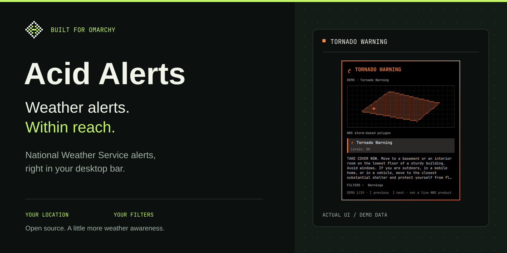
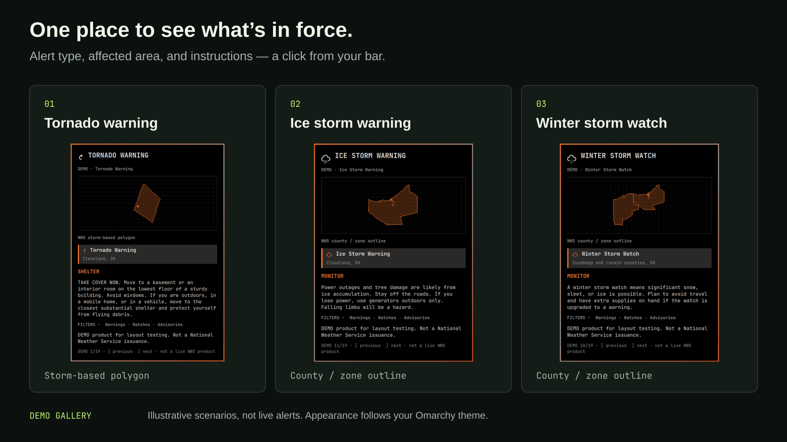
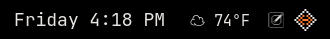
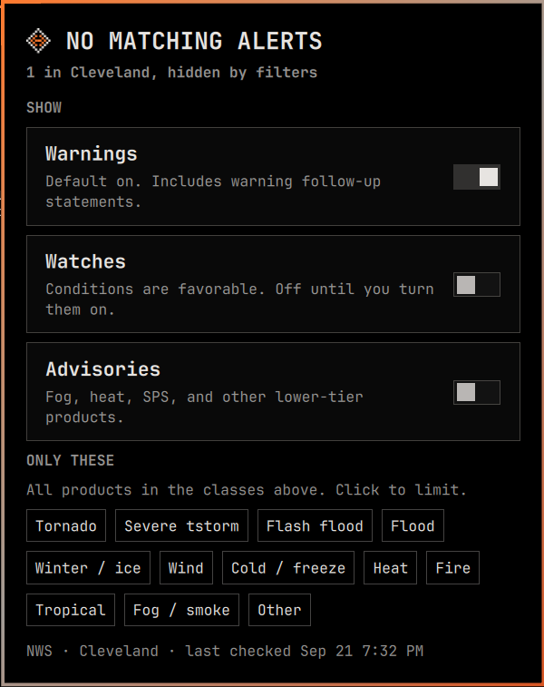

<p align="center">
  
</p>

<p align="center">
  <a href="#install">Install</a> ·
  <a href="#see-it-in-action">See it in action</a> ·
  <a href="#make-it-yours">Settings</a> ·
  <a href="#weather-safety">Weather safety</a>
</p>

# Acid Alerts

**A little more weather awareness, right where you work.**

Acid Alerts brings [National Weather Service](https://www.weather.gov/) alerts to [Omarchy](https://omarchy.org). A small pixel diamond lives in your bar; when a matching alert is active, the bar shows the event. Click to see its affected area and instructions.

- **Local by default.** Uses your Omarchy weather location, with an optional location override.
- **Warnings first.** Warnings are enabled out of the box. Add watches, advisories, or specific weather families to suit your needs.
- **See the affected area.** Displays NWS storm polygons or county / zone outlines, depending on the alert.
- **At home on your desktop.** Follows your Omarchy theme, with keyboard controls and desktop notifications for newly detected qualifying alerts.

For locations covered by NWS in the **United States and its territories**. This is an alert viewer, not a forecast or radar app.

> **Keep more than one way to receive warnings.** Acid Alerts depends on your desktop, internet connection, and periodic NWS checks. Use it alongside Wireless Emergency Alerts, NOAA Weather Radio, and local emergency guidance.

## Install

Requires an Omarchy installation with shell plugin support, curl 8.4.0 or newer, and a configured weather location.

```sh
omarchy plugin add https://github.com/neilofneils404/acid-alerts.git --enable
```

Acid Alerts uses the location set by `omarchy-weather-location`. Open the diamond in your bar to review your filters. The default refresh interval is **60 seconds**.

## See it in action

<p align="center">
  
</p>

**Actual plugin UI, demo data.** These are illustrative Cleveland / Cuyahoga County scenarios from the built-in gallery, not live NWS alerts. The alert text and storm polygon in demo mode are examples; county / zone outlines come from the bundled zone data. Colors follow the active Omarchy theme.

View full-size panels: [Tornado warning](docs/media/tornado.png) · [Ice storm warning](docs/media/ice-storm.png) · [Winter storm watch](docs/media/winter-watch.png)

In live mode, the plugin requests active NWS alerts for your location and applies your filters. Storm-based products can show the polygon issued by the forecast office; county- and zone-based products use NWS boundary outlines. Filters collapse while an alert is open to leave more room for the alert itself.

<details>
<summary>Explore the demo gallery</summary>

Set `"demo": true` on the Acid Alerts widget entry in `~/.config/omarchy/shell.json`. Open the panel and use `[` / `]` to cycle through scenarios. The footer labels demo mode, and demo alerts do not send notifications.

**Set `"demo": false` or remove the key to return to live alerts.** Demo mode displays sample scenarios instead of monitoring live alerts.

</details>

## Make it yours

<p align="center">
  
</p>

<p align="center">
  
</p>

A successful live check with no alerts matching the selected filters. This is a captured example, not a current weather report.

Change alert filters in the panel, or edit the Acid Alerts widget entry in `~/.config/omarchy/shell.json`. Panel toggles save to the same settings.

| Setting | Default | What it does |
| --- | --- | --- |
| `showWarnings` | `true` | Show warning products. |
| `showWatches` | `false` | Include watches. |
| `showAdvisories` | `false` | Include advisories, statements, and similar products. |
| `families` | `[]` | Include all weather families, or limit to the selected families below. |
| `refreshSeconds` | `60` | Seconds between checks; minimum `30`. |
| `latitude` / `longitude` / `name` | Omarchy weather location | Override the plugin location without changing your weather settings. |
| `demo` | `false` | Show sample alerts instead of live data. |

Available families: `tornado`, `thunderstorm`, `flashflood`, `flood`, `winter`, `wind`, `cold`, `heat`, `fire`, `tropical`, `fog`, `other`.

For tornado warnings only, keep **Warnings** on, leave **Watches** and **Advisories** off, and select the **Tornado** family. Filtering narrows what you see and which newly detected alerts can notify you.

### Controls

| Action | Control |
| --- | --- |
| Open or close the panel | Left click |
| Refresh | Middle click, or `r` with the panel open |
| Close | `Escape` |
| Show or hide filters during an alert | `f` |
| Select among active alerts | `↑` / `↓` |
| Previous or next demo scene | `[` / `]` in demo mode |

### Uninstall

```sh
omarchy plugin remove neil.acid-alerts
```

## Weather safety

Acid Alerts is an independent desktop plugin that displays official NWS data in live mode. It is not an official NWS product, and it cannot guarantee delivery of every alert. Network outages, a sleeping computer, filters, and polling delays can prevent or delay an alert. Previously unseen severe or extreme alerts can notify on the first load; lower-severity alerts have additional notification restrictions.

The panel shows **ALERTS UNAVAILABLE** when a check fails without any cached alerts. Previously loaded alerts remain visible with a last-known-data notice and the last successful check time. **NO MATCHING ALERTS** means a successful check found nothing matching your filters.

**An empty panel is not a guarantee of safe weather.** Keep Wireless Emergency Alerts enabled, have access to NOAA Weather Radio, and follow instructions from your local weather office and emergency officials.

## Contributing

Bug reports, clearer documentation, and improvements to alert handling are welcome. [Open an issue](https://github.com/neilofneils404/acid-alerts/issues) with your Omarchy version, what happened, and what you expected. Remove precise location details from logs or screenshots before sharing them.

NWS alert and zone transfers are capped at 1 MiB each, including responses without a Content-Length header (requires curl 8.4.0+). Failed or truncated transfers are discarded before parsing; the parsers also check the UTF-8 byte limit. Failed zone responses are not cached. Curl runs with its default config disabled so local curl options cannot override these bounds.

The model, panel state, and local HTTP transfer regression tests run with Node.js and curl:

```sh
node tests/test-model.js
node tests/test-panel-state.js
node tests/test-response-limits.js
```

Brand assets, editable SVG sources, and rendering instructions are documented in [branding/README.md](branding/README.md).

[MIT licensed](LICENSE). Live alert text and geographic data are supplied by the [NWS API](https://www.weather.gov/documentation/services-web-api).
