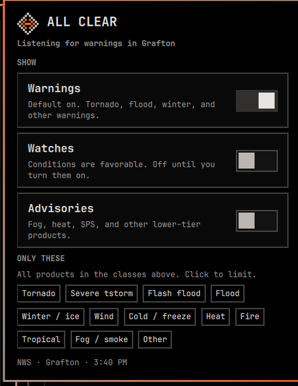
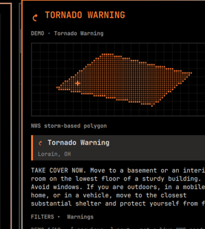
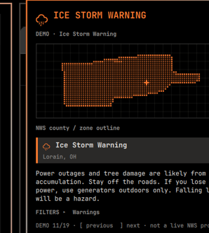
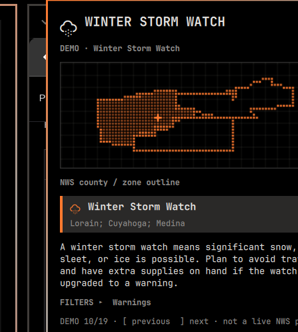

# Acid Alerts

National Weather Service alerts for [Omarchy](https://omarchy.org). A diamond sits in the bar. When something is in force, it becomes the event.

<p align="center">
  
</p>

Not a forecast. Not radar. Not a replacement for Wireless Emergency Alerts or NOAA Weather Radio.

```sh
omarchy plugin add https://github.com/neilofneils404/acid-alerts.git --enable
```

Uses the same location as Omarchy weather (`omarchy-weather-location`). United States and territories, because that is [api.weather.gov](https://www.weather.gov/documentation/services-web-api).

## All clear

The mark stays on the bar so you always have a place to click. Filters live here: warnings on by default, watches and advisories opt-in, family chips if you only want tornado (or winter, or fire).

<p align="center">
  
</p>

## When it hits

The card is just the product: type, pixel footprint, instruction. Filters fold under `FILTERS ▸` so a laptop screen still sees the warning. Short displays shrink the map. Omarchy also caps the card to the screen and lets it scroll.

<p align="center">
  
</p>

Storm-based warnings (tornado, severe thunderstorm, flash flood, snow squall) draw the **polygon the forecast office issued**. Winter, ice, and watches draw **official NWS county / zone outlines**.

<p align="center">
  
  
</p>

Ice and winter watch shots above are the demo gallery (`"demo": true` in the widget entry) so you can see product types without waiting on weather. The footer says DEMO. Live mode only shows what NWS has in force at your point.

## Keys

| | |
| --- | --- |
| Left click | Open / close |
| Middle click | Refresh |
| Escape | Close |
| `f` | Filters (while an alert is up) |
| `r` | Refresh |
| Up / Down | Stacked alerts |
| `[` `]` | Demo scenes, demo mode only |

## Settings

Widget entry in `~/.config/omarchy/shell.json`, or the panel toggles (they write the same keys).

| Key | Default | Meaning |
| --- | --- | --- |
| `showWarnings` | `true` | Warning products |
| `showWatches` | `false` | Watch products |
| `showAdvisories` | `false` | Advisories, statements, similar |
| `families` | `[]` | Limit to `tornado`, `thunderstorm`, `flashflood`, `flood`, `winter`, `wind`, `cold`, `heat`, `fire`, `tropical`, `fog`, `other` |
| `refreshSeconds` | `60` | Poll interval, minimum `30` |
| `latitude` / `longitude` / `name` | weather.json | Optional override; never writes the weather file |

Tornado-only: Warnings on, everything else off, **Tornado** chip highlighted.

```sh
omarchy plugin remove neil.acid-alerts
```

## Safety

Acid Alerts is a desktop glance at official NWS products. It can miss a poll or a network blip. For life-threatening weather, use NOAA Weather Radio, Wireless Emergency Alerts, and local instructions.

MIT. Alert text and polygons are U.S. Government public-domain NWS data.
